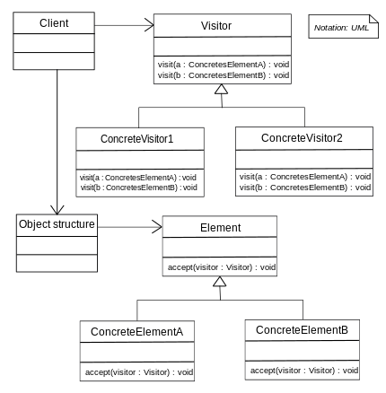

# Visitor Pattern

- 구조 안을 돌아다니며 일을 함 "방문자"

* 여러 요소에 대해 유사한 기능의 메서드를 한곳에 모아서 관리하게 되고, 여러 클래스에 걸친 메서드를 추가하기 용이함
* 각 클래스에 대한 기능이 자주 변경되거나 알고리즘의 변화가 많을때 사용하는것이 효율적임
* 각 객체의 오퍼레이션이 외부에 노출되는 것이므로 객체지향 프로그래밍의 캡슐화 전략에 위배
* 주로 Composite 패턴에서 자주 사용될 수 있음

  (출처 : https://en.wikipedia.org/wiki/Visitor_pattern)
  

- Visitor :각 객체에서 수행해야 할 기능을 선언한다. 메서드의 이름은 요청을 받을 객체를 명시한다.

* ConcreteVisitor : Visitor 클래스에 선언된 메서드를 구현한다. 각 메서드는 객체에 해당하는 알고리즘을 구현한다.

  - src/ListVisitor

* Element : Visitor가 수행될 수 있는 Accept() 메서드를 선언한다.
  - src/Acceptor
* ConcreteElement : 매개변수로 Visitor를 받아주는 Accept()메서드를 구현한다.
  - src/Directory, File
* ConcreteAggregate : 해당하는 ConcreteIteratir의 인스턴스를 반환하도록 Iterator 생성 인터페이스를 구현

  - src/Entry

* 원래 file이랑 directory 내부에서 자기가 가지고 있는 요소들을 나열하는 거를 했었는 데, 그걸 ListVisitor가 하도록

* 새로운 요소 클래스를 추가하게 되면 그에 해당되는 기능을 모든 Visitor에서 구현해하 함
* 따라서 요소의 변화가 거의 없고 기능의 추가 삭제가 자주 발생할때 사용하는것이 좋음
  - file이랑 directory이 클래스들은 변하지 않아야 함. 만약 새로운 Folder라는 클래스(extends Entry한)가 생겼다면 Visitor에 Folder를 위한 추상메소드(요소)를 만들어 줘야함. 그리고 ListVisitor에도 Folder를 위한 메소드를 추가해줘야함.
  - 이렇게 요소가 추가될 때마다 visitor들을 고쳐야 함. 그래서 요소가 자주 바뀌는 곳에는 쓰는 게 좋지 않다.
