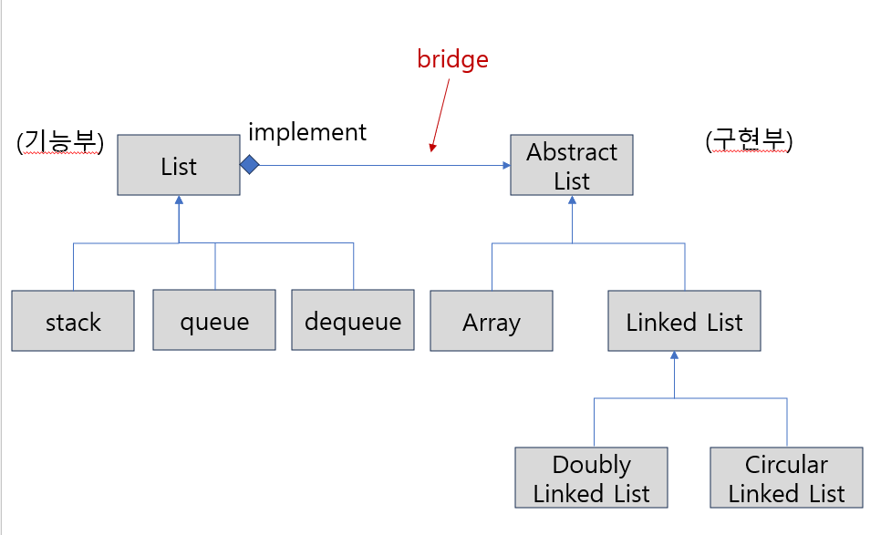

# Bridge Pattern

- 기능의 계층과 구현의 계층을 분리함
- 추상화와 구현을 분리하여 각각을 독립적으로 변경할 수 있게 함
  

* 위 그림으로 brige pattern을 설명

  - 구현부를 확장하는 쪽, 기능부분을 확장하는 쪽 두군데로 나눈다.
  - 기능부 : list가 있는 데 stack/queue/dequeue 등이 있다.
  - 구현부 :abstract list를 구현한 array가 있고 linked list가 있다.
    - linked list에 doubly linked list, circular linked list가 있을 수 있다.
  - list에 abstract list를 하나 포함하고 있다. 즉, stack/queue/dequeue를 구현하기 위해 array를 가져다 쓸 수도 있고, linked list를 가져도 쓸 수도 있다.

  * **기능 부분과 구현 부분의 다리가 연결되어 있다고 해서 bridge pattern**

* 기능의 확장과 구현의 확장을 따로 계층화 함
* 기능과 구현이 혼재하면 상속의 관계가 복잡해짐
* 두 계층을 분리하고 서로의 사이에 다리(Bridge)가 필요함

* 기능과 구현의 결합도 약하므로, 기능이 구현 방식에 얽매이지 않는다.
* 기능과 구현은 독립적으로 확장되며, 클라이언트는 기능의 인터페이스를 사용하므로 구체적인 구현내용은 숨길 수 있다.
