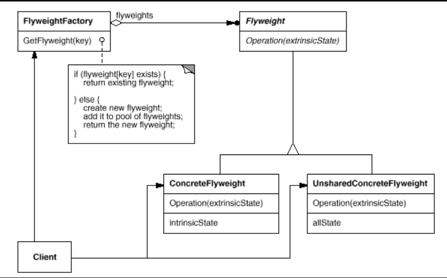
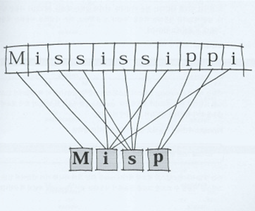

# Flyweight Pattern

- 공유 할 수 있는 객체는 공유하여 사용한다.

- 규모가 작고, 인스턴스마다 특성이 따로 없다면 공유해서 사용할 수 있다.

* 공유를 통하여 인스턴스의 수를 절약한다.
* 인스턴스마다의 특성이 거의 없는 객체에 사용하는 것이 효율적이다. 부가적인 정보가 많은 경우는 비효율적일 수 있다.

(출처 : 패스트캠퍼스 디자인 패턴 강의)

- Flyweight : 각 객체가 사용할 인터페이스를 정의한다.
- CocreteFlyweight : 공유될 수 있는 실제적 객체를 구현
- UnSharedCocreteFlyweight :각 인스턴스마다 가지게 되는 부가적인 특성이 있다면 구현한다.
- FlyweightFactory : Flyweight에 pool을 관리한다. 각 Flyweight 객체는 Singleton으로 생성한다.

위 이미지 처럼 mississippi라는 문자를 만들기 위해 m,i,s,p(CocreteFlyweight) 객체를 생성해서 pool에 넣어두고 동일한 문자 요청이 오면 pool에서 꺼내서 주고, pool에 없다면 문자객체 생성해서 pool에 넣는다.
