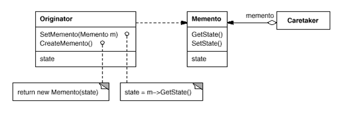

# Memento Pattern

- 인스턴스의 상태를 보존해 두었다가 보존해 둔 정보를 가지고 인스턴스를 원래 상태로 복원
- 인스턴스를 복원하기 위해서는 내부 정보에 자유롭게 접근 가능해야 함
- 캡슐화가 파괴가 일어나지 않도록 주의해야 함

* 이전의 상태로 되돌리는 undo
* 했던 작업을 다시 하는 redo
* 기억해야 하는 순간을 저장하는 객체
* 오류를 복구하거나 수행 결과를 취소하기 위한 작업에 사용

  (출처 : 패스트캠퍼스 디자인패턴 강의)
  

  - Memento : Originator 객체의 내부 상태를 필요한 만큼 저장한다. Originator만이 Memento에 접근할 수 있다.
  - Originator : Memento를 생성하여 현재 객체의 상태를 저장하고 내부 상태를 복구

    - src/Gamer

  - CareTaker (undo mechanism) :
    Memento의 보관을 책임지기는 하지만, memento의 내부를 확인할 수 없음
    - index.ts에 history

* 복구에 필요한 (클라이언트가 요구하는) 상태만 따로 관리함으로써, Originator 내부에서 저장하지 않고 Originator가 단순해질수 있다.
