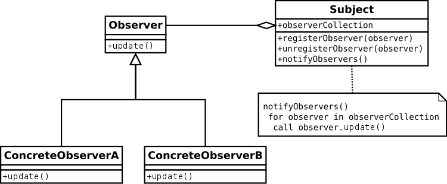

# Observer Pattern

- 객체 사이에 일대다의 의존 관계가 있고, 어떤 객체의 상태변하게 되면 그 객체에 의존성을 가진 다른 객체들이 변화의 통지(notify or update)를 받고 자동으로 갱신될 수 있게 함
  (출처 : https://en.wikipedia.org/wiki/Observer_pattern)
  

* Subject : Observer를 알고 있는 주체, Observer를 더하거나 뺄수 있음
  - 이 예제에서 : NumberGenerator
* notifyObserver : ConcreteObserver에게 알려주어야하는 상태가 변경될때 통보 (주로 List로 Observer관리)
* Observer : Subject의 변화에 관심을 가지는 객체, 갱신에 필요한 인터페이스 정의, 객체들의 일관성을 유지
* ConcreteObserver : 객체에 대한 참조자를 관리하고, Subject의 일관성 유지하며, Subject가 변경될 때 갱신되는 인터페이스 구현
  - 이 예제에서 : DigitObserver
  - 이 예제에서 : GraphObserver
