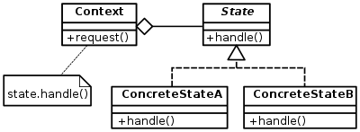

# State Pattern

- 클래스가 하나의 상태에 따라 그 내부의 여러 메서드의 기능이 바뀐다고 하면 이를 각각의 클래스로 분리한다.

* 클래스 내부에서 변수 하나에 너무 의존적으로 클래스안에서 if else문이 많을 경우 이 패턴 고려

(출처 : https://en.wikipedia.org/wiki/State_pattern)

- Context : ConcreteState의 인스턴스를 관리하고 서로 상태가 바뀌는 순간을 구현할 수 있다.
  - usePatternExam/Player
- State : Context 가 사용할 메서드를 선언한다.
  - usePatternExam/PlayerLevel
- ConcreateState : 각 상태 클래스가 수행할 State에 선언된 메서드를 구현한다.
  - usePatternExam/BeginnerLevel , AdvancedLevel, SuperLevel

* **State Pattern을 사용안한 경우의 예제** => src/noUsePatternExam 참고
  - 해당 예제에서 level이란 변수에 따라 메소드들의 기능이 바뀜, 레벨이 추가될 때마다 메소드들도 추가 작업해야 함. 즉, level에 종속적
* **State Pattern을 사용 경우의 예제** => src/usePatternExam 참고
  - level 1이 하던거 => BeginnerLevel
  - level 2이 하던거 => AdvancedLevel
  - level 3이 하던거 => SuperLevel
  * 여기서 레벨이 더 추가되면 PlayerLevel를 상속받은 클래스만 추가하면 됨.
