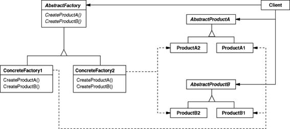

# Abstract Factory Pattern

- 여러 제품군을 한꺼번에 생성하는 패턴

* 추상화된 인터페이스 팩토리를 제공하고 상황에 따라 그에 맞는 인스턴스들이 생성되도록 함. 가령 데이터베이스에 따라 DAO클래스가 달라져야 한다고 할 때, 현재 사용해야 하는 DB의 종류에 따른 DAO 인스턴스를 한꺼번에 생성하도록 한다.



```
[client]

[DaoFactory]
=> MysqlDaoFactory
=> OracleDaoFactory

[UserInfoDao]
=> MysqlUserInfoDao
=> OracleUserInfoDao

[ProductDao]
=> MysqlUserProductDao
=> OracleUserProductDao
```

- 예제 소스코드는 쇼핑몰이라고 가정했을 때, UserInfoDao는 사용자 관련한 dao, ProductDao는 제품 관련 dao임

- client는 factory만 선택하면 모든 dao세트로 돌아가게끔.

* 일반적으로 ConcreteFactory(위 예제에서 MysqlDaoFactory, OracleDaoFactory) 클래스의 인스턴스는 실행 할 때 만들어진다.
