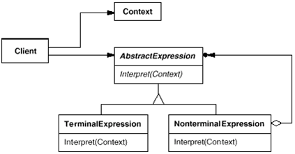

# Interpreter Pattern

- 문법 규칙을 클래스로 표현
- 간단한 프로그램을 해석하기 위한 패턴

* 복잡한 문법은 사용할 수 없다.
* 실무에서 사용할 일은 거의 없음

  (출처 : https://en.wikipedia.org/wiki/Interpreter_pattern)
  

* AbstractExpress : 추상 구문 트리에 속한 모든 노드가 가져야할 공통의 메서드 interpte() 오퍼레이션 선언
* TerminalExpression : 터미널 기호에 대한 해석방법을 구현
* NonterminalExpression : 재귀적으로 호출되어 다른 AbstractExpression으로 구문을 패쓰하게 된다.
* Context : 번역기에 대한 포괄적인 정보 포함
* Client : Syntax를 실제로 정의하고 추상 구문 트리를 생성하고 각 문법 표현 클래스의 interpret() 메서드를 호출한다.
