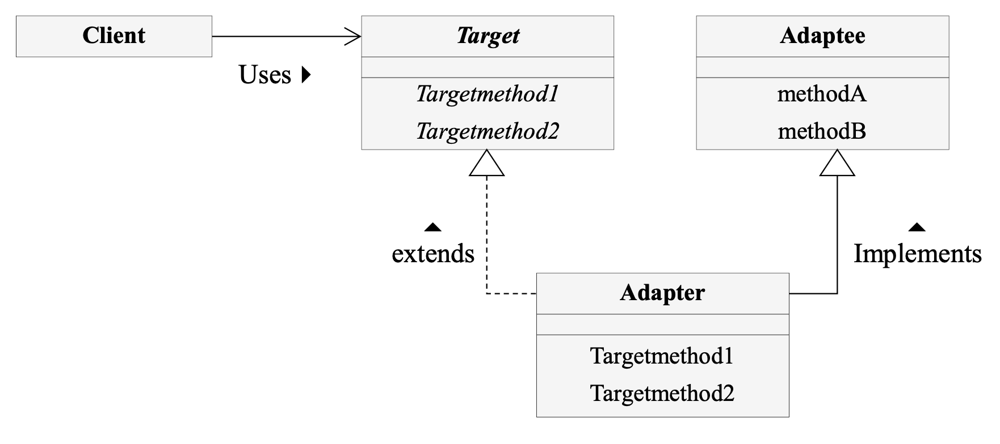
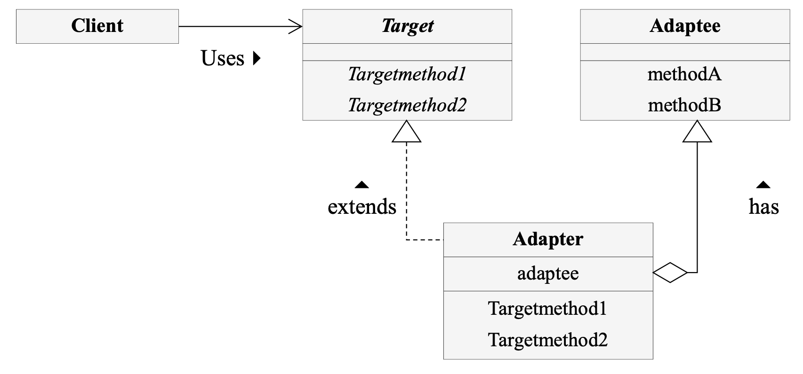

# Adapter Pattern

- 서로 다른 인터페이스를 중간에서 연결해주는 기능

* Wrapper

(출처 : 패스트캠퍼스 디자인패턴강의)

- 상속
  
- 합성
  

* Target : 클라이언트가 사용할 인터페이스를 정의 하고 있는 클래스
* Client : Target 인터페이스를 사용하는 객체
* Adaptee : 실제 제공되는 기능을 구현한 클래스
* Adapter : Target 인터페이스에 Adaptee의 인터페이스를 맞춰주는 클래스

- Target에서 Adapter를 통해 Adaptee를 사용할 때 상속, 합성 두가지 방법이 있다.
  - 상속 : Adaptee를 Adapter가 상속받음.
  - 합성 : Adapter가 변수로 Adaptee객체를 가진다. 더 확장성있게 재사용할 목적일 경우 사용
